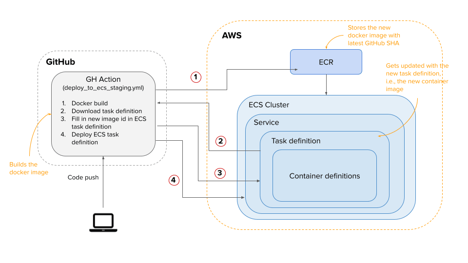

## Deployment
This document covers the steps on setting up this repository on various cloud hosting providers.

  - [AWS](#aws)

# AWS

## Pre-requisites

Deploying on AWS requires a basic understanding of the following tools and services:
1. Docker
2. GitHub actions & workflows
3. GitHub environments and secrets
4. AWS Elastic Container Registry (ECR)
5. AWS Elastic Container Service (ECS)
6. AWS Virtual Private Cloud (VPC)
7. AWS Fargate
8. AWS Elastic Load Balancer (ELB)
9. AWS Elastic IPs
10. AWS Identity and Access Management (IAM)
11. AWS Relational Database Service (RDS)

## Staging

### Continuous Delivery process

An overview of how the continuous delivery cycle works in Plio with GitHub action and Amazon ECR & ECS.

Follow the steps below to set up the staging environment on AWS.

1. Login to your AWS console.

2. Go to VPC. (skip this step if you've already created a VPC when setting up the frontend or backend repository)
   1. Create a new VPC.
   2. Name it `plio-staging`.
   3. In IPv4 CIDR block, enter `10.0.0.0/16` - this will reserve 256 * 256 IPs within the VPC.
   4. Click on the create button. You will see the new VPC under the list of VPCs.
   5. Check out this [AWS guide for more details on VPC](https://docs.aws.amazon.com/vpc/latest/userguide/working-with-vpcs.html).

   6. You'll need to attach an Internet Gateway to this VPC.
      1. Click on `Internet Gateways` in the VPC Dashboard.
      2. Select `Create internet Gateaway`.
      3. Name it as `plio-staging` and save it.
      4. Click on `Attach to a VPC` in the next page and select the VPC created above.

   7. Next, you'll need to attach Subnets to the VPC created above.
      1. Click on `Subnets` in the VPC Dashboard.
      2. Click on `Create Subnet`.
      3. Choose the VPC created above as VPC ID.
      4. Enter the `Subnet name` as `plio-staging-1`.
      5. Either choose the `Availability Zone` if you have a preference or leave it to the default
      6. Under `IPv4 CIDR block`, add a range of IPv4s that belong to your subnet. If you followed the steps above exactly, you can set this value as `10.0.0.0/24`. This will reserve the IPs `10.0.0.0` to `10.0.0.255` to this Subnet.
      7. If you want to, you can create more subnets using `Add new subnet`  but it's not needed going forward. If you do choose to do so, you'll need to choose a different non-overlapping range of IPv4s for the `IPv4 CIDR block` option - for example, you could set it to: `10.0.1.0/24` to reserve the  IPs `10.0.1.0` to `10.0.1.255`.
      8. Finally, create the subnet.

   8. You need to update your `Route Tables` to give make your subnets publicly accessible.
      1. Click on `Route Tables` in the VPC Dashboard
      2. Select the entry corresponding to the VPC you created above.
      3. Navigate to the `Routes` tab.
      4. Click on `Edit routes`.
      5. Click on `Add route`.
      6. Add `0.0.0.0/0` as the `Destination`.
      7. Select `Internet Gateway` under `Target` and link to the Internet Gateway you created above.
      8. Click on `Save routes`.

3. Create a new Elastic IP by going to EC2 dashboard and navigating to the `Elastic IP` section.
   1. Click on `Allocate Elastic IP address` and click on `Allocate` .
   2. You will see a new IP address in the IPs list. Name it `plio-analytics-staging`.
   3. This will be used in later steps to give the load balancer a permanent IP address.

4. Go to Target groups.
   1. Create a new target group.
   2. Choose target type to be `IP addresses`.
   3. Name the target group as `plio-analytics-staging`.
   4. Set the protocol to `TCP` and port to `80`.
   5. Select the `plio-staging` for the target group VPC.
   6. In the next step, add an IP address in the `IP` text area - the IP address should belong to your VPC - if you followed the steps above exactly, you can use any IP address between `10.0.0.0` to `10.0.255.255`.
   7. Proceed to create the target group. You will see the created target group in the list of all target groups.

5. Go to Load Balancers (LBs).
   1. Create a new load balancer.
   2. Select `Network Load Balancer` option. We use NLB for easy support of web socket connections.
   3. Name the LB as `plio-analytics-staging`.
   4. Select the `plio-staging` VPC for the load balancer.
   5. In the subnet mappings, check the first desired zone and use Elastic IP under IPv4 settings for that subnet.
   6. Under listeners and routing, select the target group `plio-analytics-staging` for TCP port 80.
   7. Proceed to create the load balancer. You will see the created load balancer in the list of all load balancers.

6. Go to ECR and create a new repository named `plio-analytics-staging` and set the settings as per your needs.

7. Now go to ECS and create a new task definition

    1. Select Fargate and name the task definition as `plio-analytics-staging`.
    2. Set the task role as `ecsTaskExecutionRole`.
    3. Set the task memory and task CPU based on your needs. Good defaults to use are: 2 GB for memory and 0.5 vCPU.
    4. Create a new container with name `plio-analytics-staging`.
    5. In the image field, you can just type in `image_arn`. This is not a valid entry and just a placeholder for now as it'll be replaced by the actual image ARN once the GitHub workflow triggers.
    6. Enter port `80` in the port mapping field.
    7. Use the `.env.example` file to set all the required environment variables for your container in the `Environment Variables` section.
       1. Set all `CUBEJS_DB_*` variables to your AWS RDS setup. `CUBEJS_DB_TYPE` should be postgres.
       2. For production, set `CUBEJS_DEV_MODE` to false.
       3. Ignore the variables under `local web server`.
       4. Leave the variables `CUBEJS_REDIS_URL` and `CUBEJS_REDIS_PASSWORD` as empty for now. We'll fill them up later.
       5. Ignore the variables under `local web server`.
    8.  Save the container definition and the task definition.
    9.  You will see the new task definition within the list of all task definitions.

8. Under ECS, go to `Clusters` and create a new cluster with the name `plio-staging-cluster`. (skip this step if you've already created a Cluster when setting up the frontend/backend repository)
    1. Select `Networking only`. We will go with serverless deployment so that we don't worry about managing our own server instances.
    2. Don't create a new VPC for your cluster. We'll use the VPC created in previous step in the next step of creating a service.
    3. Click on the create button.
    4. You will see the new cluster within the list of clusters.

9.  Get into `plio-staging-cluster` and create a new service.

       1. Set launch type to Fargate. We'll use serverless deployments for Plio.
       2. Name the service as `plio-analytics-staging`.
       3. Under task definition, select `plio-analytics-staging` and use latest revision.
       4. Set the number of tasks to be one.
       5. Service type to be `REPLICA`.
       6. Minimum healthy percentage should be 100 and maximum percent to be 200. Minimum healthy percentage defines the percentage of tasks that should be running at all times. Maximum percent defines how many additional tasks the service can create in parallel to running tasks, before killing the running tasks.
       7. Deployment type to be `rolling update`.
       8. Keep other values as default.
       9. Use the Cluster VPC and the subnet that you configured previously with Elastic IP.
       10. Set Auto-assign public IP to `ENABLED`. Otherwise, it makes the task accessible only through VPC and not public.
       11. Under load balancing, select the `Network Load Balancing` option and select the `plio-analytics-staging` load balancer.
       12. Inside `Container to Load Balancer`, click on `Add to load balancer option` and select `plio-analytics-staging` in the target group.
       13. For auto-scaling, go with `Do not adjust the service's desired count`  for staging.
       14. Review and create the service.

10. Create a `redis` cluster on AWS Elasticache.

      1. Go to the [ElastiCache dashboard](https://console.aws.amazon.com/elasticache/home). Select the region and click on `Create` button.
      2. Select `Redis` as your Cluster engine.
      3. Select `Cluster mode disabled`. More details on cluster mode [here](https://docs.aws.amazon.com/AmazonElastiCache/latest/red-ug/Replication.Redis-RedisCluster.html).
      4. Choose `Amazon Cloud` as your location.
      5. Set the name of your cluster as `redis-plio-analytics-staging`.
      6. Choose the latest `Engine version compatibility`.
      7. Enter `6379` as the `Port`.
      8. No need to change anything for `Parameter Group`.
      9. Choose your `Node Type`. Plio uses `cache.t2.micro`. More details [here](https://docs.aws.amazon.com/AmazonElastiCache/latest/red-ug/nodes-select-size.html#CacheNodes.SelectSize).
      10. For `Number of replicas`, enter `0`. Note: Each replica node will carry it's own cost. More on pricing [here](https://aws.amazon.com/elasticache/pricing/) and [here](https://www.reddit.com/r/aws/comments/cojaq6/questions_about_elasticache_pricing/).
      11. For high availability, select the `Multi AZ` checkbox. Take a note that this may almost double your monthly expense. More details [here](https://docs.aws.amazon.com/AmazonRDS/latest/UserGuide/Concepts.MultiAZ.html).
      12. Select `Advanced Redis settings` and fill in the details as mentioned below.
          1. For `Subnet group`, create a new group.
          2. Add the subnets that were created above.
          3. For `VPC ID`, add the VPC that was created above.
          4. For `Availability zone(s)`, choose `No preference`. More details [here](https://docs.aws.amazon.com/AmazonElastiCache/latest/red-ug/RegionsAndAZs.html).
          5. For `Security groups` choose the default security group.
      13. Click the `Create` button.
      14. Proceed when the cluster's status becomes `available`. Next we'll grant access to the cluster.
      15. Go to the AWS EC2 console [here](https://console.aws.amazon.com/ec2/).
      16. In the navigation pane, under `Network & Security`, choose `Security Groups`.
      17. Choose the `default` security group for your VPC.
      18. Choose the `Inbound` tab, and then do the following:
          1. Choose `Edit` and select `Add Rule`.
          2. In the `Type` column, choose `Custom TCP rule`.
          3. In the `Port range` box, type `6379`.
          4. In the `Source` box, choose `Anywhere`.
          5. Click `Save`.
      19. Find the endpoints of your redis instance using [this](https://docs.aws.amazon.com/AmazonElastiCache/latest/red-ug/Endpoints.html) and copy them somewhere for later use.

11. Connect the redis instance to the `plio-analytics-staging` service that was created above.
    1. Go to the ECS dashboard and select `plio-staging-cluster`.
    2. Select the `plio-analytics-staging` service.
    3. Select the `Tasks` tab.
    4. Select the running task definition in the `Task Definition` column.
    5. Click `Create new revision` button on the top and select the existing container with the name: `plio-analytics-staging`.
    6. In the new window, scroll down to `Environment Variables` section.
    7. Update the `CUBEJS_REDIS_URL` variable that were copied before. By default, AWS Elasticache has no password. In case you had configured it, make sure to update `CUBEJS_REDIS_PASSWORD` variable as well.
    8. Click the `Update` button to update the container definition.
    9. Click the `Create` button to create a new revision of the task definition.
    10. Navigate back to the service `plio-analytics-staging`.
    11. Click `Update` on top right.
    12. Update the revision of the newly created task definition and wait for it to get initiated.
    13. Wait for some time. The older task will automatically stop once the new task reaches a stable state.

12. Next, go to your GitHub repository and create a new environment from the settings tab.
    1. Name the environment as `Staging`.
    2. Make sure you have added the following GitHub secrets on repository level. If not, add these as your environment secrets.
       - AWS_ACCESS_KEY_ID
       - AWS_SECRET_ACCESS_KEY
       - AWS_REGION

13. We are using Github Actions to trigger deployments. You can find the workflow defined in `.github/workflows/deploy_to_ecs_staging.yml`. It defines a target branch such that a deployment is initiated whenever a change is pushed to the target branch.

14. Once done, push some changes to the target branch so that the GitHub workflow `deploy_to_ecs_staging.yml` gets triggered.

## Production

Setting up a production environment on AWS is almost the same as staging. Additionally, take care of the following things:
1. Repeat the steps above and rename all services as `plio-analytics-production` or a similar naming convention.
2. Change all the environment variables to the corresponding values for the production environment.
3. Go with auto-scaling option when creating a new service from ECS.
   1. When creating a service or when updating it, navigate to the service auto-scaling section.
   2. Select `Configure Service Auto Scaling to adjust your service's desired count`.
   3. Set minimum number of tasks to `1`. This is the minimum count of running tasks when scale-in operation happen.
   4. Set desired number of tasks to `1`. This may come pre-populated if you had set it before.
   5. Set maximum number of tasks to `2` or more based on your desired need. This is the maximum count of total running tasks in case of scale-out operation.
   6. In IAM role for Service Auto Scaling, select `AWSServiceRoleForApplicationAutoScaling_ECSService`.
   7. Click on `Add scaling policy`.
   8. Select policy type to `Target tracking`.
   9. Set policy name to `plio-analytics-production-autoscaling-cpu`.
   10. In the ECS service metric, select the option for average CPU utilization.
   11. Target value should be `60` (or as per your requirement). This is the threshold value when the service will trigger a new event and perform scale-out operation.
   12. Scale-out & Scale-in cooldown period to be `300` seconds.
   13. `Disable scale-in` to remain unchecked.
   14. Save the scaling policy.
   15. Create or update the service name.
   16. Use [k6.io](https://k6.io/) or other load testing tool to check if auto-scaling is working fine or not. You can lower down the target threshold for testing purposes.

### Authentication
Check out the [Authentication](./AUTHENTICATION.md) guide to set up a secure medium for API calls between the Frontend app and the Analytics app.
