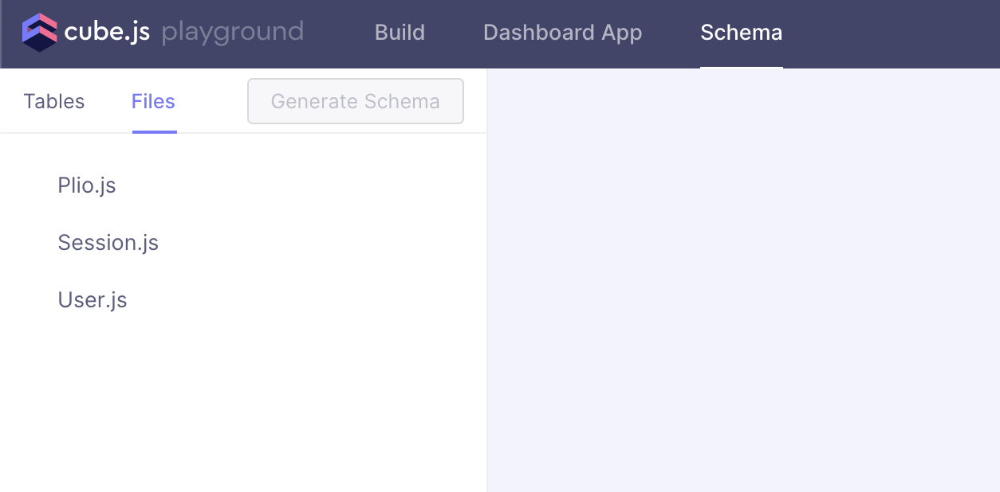

## Installation

### Pre-requisites
#### Docker
Download docker for your operating system: https://docs.docker.com/get-docker/

### Installation steps
1. Clone the repository and change the working directory
    ```sh
    git clone https://github.com/avantifellows/plio-analytics.git
    cd plio-analytics
    ```
2. For **DEVELOPMENT PURPOSE** only, make sure Docker Desktop application is running and docker version is giving a proper output.
    ```sh
    docker --version
    ```
3. Set up your `.env` file by copying `.env.example` file
    ```sh
    cp .env.example .env
    ```
4. Update environment variables in your `.env` file based on your environment. For all available settings, see our [Environment variables guide](ENV.md).
5. Build the docker image and run the containers using just one command:
    ```sh
    docker-compose up -d --build
    ```
6. For **DEVELOPMENT PURPOSE** only, run the following command to install pre-commit
    ```sh
    pre-commit install
    ```
7. Your Cube.js API and Developer Playground should be accessible at http://localhost:4000 (assuming that you set the `APP_API_PORT` environment variable as `4000`). You should be able to see the default schema and a few schema files as shown in the image below.
    
